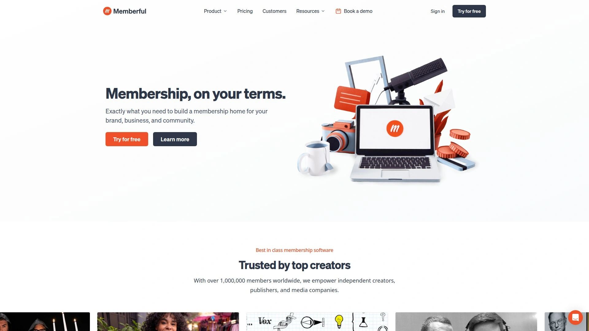

# 学会使用这18个创作者变现平台,五分钟找到最适合自己的收入来源

做独立创作者最头疼的事,莫过于找到一个靠谱的变现渠道。你可能正在创作播客、写作文章、制作视频或绘画插画,但却不知道该在哪个平台上建立稳定的订阅收入。本文精选18个主流创作者内容变现平台,从订阅会员制到打赏支持、从邮件简报到在线课程,覆盖不同类型创作者的实际需求,帮你快速锁定最匹配自己创作风格和变现目标的工具。

## **[SubscribeStar](https://subscribestar.com)**

独立运营的自由创作者订阅平台

SubscribeStar定位为一个完全独立的订阅会员平台,最大特色是对内容类型的包容度极高,为各类创作者提供安全的变现空间。平台支持创建多层级订阅等级,月费可从2美元设置到100美元以上,创作者可根据不同会员等级提供差异化内容访问权限。内置反爬虫保护功能,能有效防止付费内容被非法复制或截取,这对依赖独家内容的创作者来说是重要保障。平台收取5%的服务费用,外加支付处理费(通常2.9% + 0.30美元),达到150美元即可提现到美国或非美国银行账户、Wise或Payoneer。SubscribeStar与Discord深度整合,可以根据订阅等级自动分配Discord社群权限,便于建立分层次的粉丝社区。平台还提供自定义目标功能,创作者可以设置多个筹款目标并实时显示进度条,让粉丝看到支持的具体用途,比如"升级录音设备"或"制作新内容"。通过Dropp应用集成,粉丝还能进行一次性小额打赏,为不想订阅但愿意支持的用户提供灵活选择。

## **[Patreon](https://www.patreon.com)**

全球最大的创作者会员订阅生态

Patreon是目前用户规模最大的创作者订阅平台,服务对象涵盖漫画家、游戏开发者、播客主播、音乐人等各个领域。核心优势在于成熟的订阅分层系统,以及庞大的付费用户基础,能让创作者更容易被潜在支持者发现。平台允许销售可下载的数字产品,如电子书、模板、设计素材等,还支持实体商品销售并在结账时收集配送信息。与SubscribeStar不同,Patreon不支持一次性打赏功能。提现方式包括Stripe、PayPal和Payoneer。平台费率根据套餐不同,从5%到12%不等,还需支付支付处理费。Patreon的社区氛围更偏向主流专业创作者,品牌认知度高,适合希望快速建立公信力的创作者。

## **[Ko-fi](https://ko-fi.com)**

零费率起步的打赏与会员混合平台

Ko-fi的起源故事很有意思:创始人想给帮助过自己的程序员买杯咖啡表示感谢,于是创建了这个小额打赏平台,至今已支付超过2亿美元给创作者。入门级别完全免费,打赏功能零平台费,只需支付PayPal或Stripe的支付处理费。会员订阅、商店和委托销售功能收取5%费用。升级到Ko-fi Gold会员(每月8美元或年付6美元/月),可将会员、委托和商店销售的费用降至0%,还能解锁内容付费墙、自定义品牌颜色、预排发布等高级功能。平台提供图片视频画廊、博客文章发布、公开目标设置、实体或数字商品销售等功能。Ko-fi Gold用户可以提前体验新功能,并且能将默认的"咖啡"图标改成茶、鸡尾酒或其他任何东西。适合刚起步不想承担固定成本的创作者。

## **[Buy Me a Coffee](https://buymeacoffee.com)**

一分钟上手的极简打赏会员平台

这个平台由三位创始人于2017年在英国创立,使命是让自由职业者能轻松获得报酬。最大卖点是设置速度极快,不到一分钟就能完成注册并开始接受支持。平台统一收取5%费用,所有用户享受完全相同的功能,没有分层套餐的复杂决策。粉丝无需注册账号就能直接打赏,降低了支持门槛。功能包括一次性打赏("请我喝咖啡")、会员订阅、数字产品或服务销售、电子邮件广播、图片画廊、文字和音频帖子、愿望清单、委托销售等。与WordPress、Giphy、Zapier和Google Analytics集成。支持通过Stripe、Stripe Express、Payoneer或Wise提现。提供移动应用和全天候在线客服支持。已有超过一百万创作者使用,涵盖YouTuber、播客、艺术家、作家、程序员等各类型。

## **[Substack](https://substack.com)**

邮件简报变现的首选工具

Substack将电子邮件简报与在线博客无缝整合,是作家和内容创作者建立付费订阅的最简单方式。平台完全免费使用,但会从付费订阅收入中抽取10%。极简主义设计理念贯穿始终,上手几乎零门槛,特别适合非技术背景的创作者。除了文字简报,还支持播客托管、社交功能和移动应用,构建了一个内容生态系统。Substack的读者社区本身就是一个流量池,优质内容有机会被平台推荐给更多订阅者。但自定义能力、SEO优化和增长工具相对有限。更适合专注写作本身、希望快速启动且不想学习复杂工具的作者。

## **[beehiiv](https://beehiiv.com)**

为变现和增长而生的专业简报平台

如果说Substack适合纯粹的写作者,beehiiv则是为把简报当作生意来经营的创作者打造的。收费模式是固定月费而非收入分成,让大额收入的创作者能保留更多利润。核心优势在于强大的增长工具:自动化邮件序列、订阅者细分、A/B测试、推荐计划、跨简报互推网络效应等。beehiiv的广告网络让创作者能通过在简报中展示品牌广告获得收入,类似Google Ads的邮件版本。Boosts市场则允许创作者通过向自己的订阅者推荐其他简报来赚取收入。SEO能力、自定义程度和变现选项都远超Substack。适合将简报视为严肃商业项目、追求快速增长和多元变现的专业创作者。

## **[Gumroad](https://gumroad.com)**

数字产品快速销售平台

Gumroad专注于数字产品的一次性销售,非常适合销售PDF、视频、音频文件、软件、设计素材等。设置过程极其简单,上传文件、设定价格即可开卖。也提供会员订阅功能,很多创作者将其作为Patreon的轻量替代方案。相比全功能课程平台,Gumroad的优势在于零摩擦销售——买家点几下就能完成购买和下载。但如果要构建复杂的在线课程或深度社区互动,功能就显得不足。Gumroad收取10%费用(付费套餐可降至3.5%再加30美分交易费)。提现通过Stripe或PayPal。

## **[Podia](https://www.podia.com)**

课程、会员与数字产品一体化平台

Podia定位为全能型销售平台,支持在线课程、数字下载、辅导服务和会员订阅。课程功能包括多课时模块、视频托管、完成证书发放等。还能创建网络研讨会并与直播视频工具集成,销售工作坊访问权。支持产品打包销售和内容定时释放(如课程按周解锁)。平台提供基础网站搭建、销售页面自定义、营销邮件发送等功能。收费从每月39美元起,根据套餐不同功能有所差异。不收取交易费,所有收入归创作者。适合想在一个地方管理课程、会员和数字商品的教育类创作者。

## **[Memberful](https://memberful.com)**

WordPress会员插件与独立会员系统

Memberful最初是WordPress会员插件,现已发展为功能完整的会员管理软件。可以在WordPress网站上添加会员订阅功能,也可以使用Memberful托管的独立网站。收费为每月49美元加上4.9%的交易费。支持无限会员计划和无限会员数量。Posts功能复制了Substack的"邮件+在线"模式,可以发布仅会员可见的内容通过简报和网站同步呈现。与Stripe集成处理支付。没有收入分成,创作者保留所有订阅收入。适合已有WordPress网站或博客、希望添加会员功能的创作者,以及播客、课程制作者。

## **[Ghost](https://ghost.org)**

零交易费的独立出版平台

Ghost是专为专业出版者设计的开源平台,最大优势是零交易费——只需支付固定月费,无论收入多少都不抽成。相比之下,Memberful会收取4.9%-10%的交易费。会员功能原生集成在平台中,提供稳定可靠的专业出版解决方案。支持多层级会员订阅、邮件简报、仅会员评论等功能。适合预期收入较高的创作者,因为随着订阅收入增长,零交易费能节省大量成本。需要一定技术能力或愿意学习,不如Substack那样零门槛。

## **[Kit (ConvertKit)](https://kit.com)**

简报创作者的邮件营销与变现工具

Kit(原名ConvertKit)专注于帮助简报创作者实现订阅变现。可以设置付费简报订阅,交易费低至3.5% + 0.30美元。提供专业简报模板、自定义产品页面、结账流程完全可品牌化。自动化漏斗功能强大,可以设置自动化邮件序列,将免费订阅者转化为付费客户。付费推荐功能让创作者通过推荐其他简报获得收入。提现通过连接的Stripe账户。Kit专门服务于简报创作者、博主、在线教育者等知识型创作者。月费从免费套餐到根据订阅者数量阶梯定价。

## **[Teachable](https://teachable.com)**

在线课程创建与销售专业平台

Teachable是专门为在线教育设计的课程平台,提供完整的课程创建、托管和销售工具。支持视频课程、测验、作业、讨论区等教学功能。可以自定义课程网站和销售页面,集成支付处理。提供学生进度追踪、证书颁发、优惠券营销等功能。收费模式从每月39美元起,高级套餐交易费更低。适合教师、培训师、专业人士创建和销售结构化在线课程。与Thinkific是主要竞争对手,两者功能接近。

## **[Thinkific](https://www.thinkific.com)**

课程创作者的全能教学平台

Thinkific与Teachable定位相似,都是顶级在线课程平台。提供拖拽式课程构建器、多媒体内容支持、学生管理系统。独特之处在于更强的社区功能和会员网站选项。支持直播课程、作业提交、讨论论坛。免费套餐可以创建无限课程,付费套餐从每月49美元起。零交易费(但支付处理费由Stripe收取)。适合想要完全控制品牌和学生体验的教育创作者。

## **[Kajabi](https://kajabi.com)**

一站式数字产品营销与销售系统

Kajabi是高端全能平台,整合了网站建设、邮件营销、销售漏斗和课程托管。不仅能创建课程,还能构建完整的营销自动化流程。提供预建网站模板、登陆页面、销售漏斗模板。内置CRM和分析工具,帮助创作者管理客户关系和优化转化。月费从149美元起,定位高端专业创作者。适合将数字产品当作严肃生意、需要完整营销工具栈的企业家和教练。

## **[Mighty Networks](https://www.mightynetworks.com)**

社区优先的会员与课程平台

Mighty Networks的核心理念是"社区优先",专注于建立有活力的互动社区。会员可以在"空间"中实时聊天、发帖、投票,创造强烈的归属感。也支持课程功能,但课程嵌入在社区环境中,便于学员交流讨论。支持直播活动、分组、会员目录等社交功能。收费从每月39美元起。相比Kajabi的营销自动化强项,Mighty Networks更擅长社区互动和会员留存。适合想要建立紧密粉丝社群、而不仅是销售产品的创作者。

## **[Liberapay](https://liberapay.com)**

零费率的开源创作者捐赠平台

Liberapay是一个非营利性的循环捐赠平台,专为自由软件开发者、艺术家和内容创作者设计。最大特色是完全不收取平台费用,仅有支付处理器(PayPal和Stripe)收取的必要手续费。平台本身通过接受捐赠来维持运营。与Patreon不同,Liberapay不允许创作者给支持者提供回报或奖励,纯粹是捐赠性质,这在税务处理上有差异。2015年在法国成立,最初只支持欧元,后来扩展到美元和其他33种货币。2021年数据显示每周捐赠额达8000欧元,有5977位捐赠者和912位创作者。适合开源项目维护者和理念型创作者。

## **[Fanvue](https://fanvue.com)**

支持AI整合的多元创作者平台

Fanvue采用与OnlyFans类似的订阅模式和界面,但提供更高的创作者分成比例——高达85%。支持健身、Cosplay、成人内容、生活方式等多种创作类型。独特之处在于支持AI技术整合,如聊天机器人和性能分析工具。提供多种变现选项:按次付费、直播、打赏、自定义内容包。平台强调账户安全和内容保护,防止盗版和黑客攻击。客服响应方面有一些用户反馈不够及时。适合需要灵活内容政策和AI功能支持的创作者。

## **[Fansly](https://fansly.com)**

注重内容保护的订阅平台

Fansly提供与OnlyFans相似的功能,包括分层订阅、直接消息、升级销售包等。用户体验在内容推广方面表现更出色,"For You"页面会根据粉丝浏览历史推荐内容,高互动内容获得更多曝光。内容保护政策严格,防止泄露和盗版。提供地理屏蔽功能,创作者可以控制内容在特定地区不展示,增强隐私控制。客服响应速度快。相比OnlyFans,用户基数较小但在快速增长。

## **[Locals](https://locals.com)**

独立声音的社区订阅平台

Locals定位为独立创作者的社区工具,提供社区互动和订阅管理功能。创作者可以完全控制自己的社区、内容和受众。支持多种内容格式和会员等级设置。强调创作者的独立性和自主权,不受平台内容审查限制。适合有明确观点和忠实粉丝群的创作者。

## **FAQ常见问题**

**Q: 新手创作者应该选择免费平台还是付费平台?**
A: 建议从零费率或低门槛平台起步,如Ko-fi的免费打赏功能或Substack的免费简报,待积累稳定受众后再考虑功能更完整的付费平台。这样能在不承担固定成本的情况下测试市场反应和变现潜力。

**Q: 订阅制和打赏制哪种变现方式更稳定?**
A: 订阅制提供可预测的循环收入,更适合持续产出内容的创作者,如每周发布的播客或简报。打赏制适合内容产出不规律或刚起步的创作者,给支持者更灵活的选择。理想方案是像SubscribeStar那样同时支持两种方式,满足不同粉丝的支持习惯。

**Q: 如何判断平台费率是否合理?**
A: 需要综合考虑平台费、交易费和提现费。零交易费平台如Ghost适合高收入创作者,因为固定月费比例会随收入增长而降低。收入分成模式如Substack的10%或Patreon的5%-12%对小额收入创作者更友好,因为收入低时实际支出也少。还要关注是否有隐藏费用,比如提现手续费或货币转换费。

## 结语

从自由度最高的SubscribeStar到用户规模最大的Patreon,从简报专用的Substack到课程平台Teachable,18个平台各有侧重点。对于追求内容自由度、需要灵活订阅等级设置、重视粉丝社区管理的创作者,[SubscribeStar](https://subscribestar.com)凭借其独立运营理念、完善的内容保护机制和Discord深度整合,成为平衡变现效率与创作自主权的理想选择。选对平台只是第一步,持续产出优质内容才是建立稳定收入的核心。
